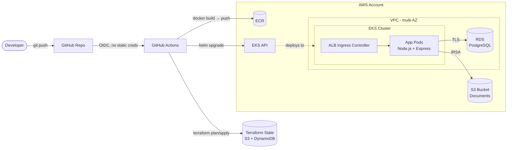

# modern-devops-eks-terraform-helm

[]()
[]()
[]()
[]()
[](LICENSE)

End-to-end modern DevOps demonstration: Terraform IaC provisions a secure, scalable AWS EKS cluster (VPC, managed node groups, RDS PostgreSQL, ECR) plus supporting services. Helm charts deploy a sample document-processing application. A full GitHub Actions CI/CD pipeline uses OIDC for keyless AWS authentication. Built to demonstrate production-grade IaC, Kubernetes-native deployments, and modern CI/CD practices.

> **Status (May 2026):** Repository scaffolding in progress. Architecture, design decisions, and roadmap are documented below; implementation lands incrementally in tracked phases. See [Roadmap](#roadmap).

## Architecture



See [docs/architecture.md](docs/architecture.md) for component-level diagrams (network topology, CI/CD flow, IRSA) and design rationale.

## Tech Stack

| Layer | Technology |
|-------|-----------|
| IaC | Terraform 1.7+, `terraform-aws-modules/eks` |
| Cloud | AWS — EKS, VPC, RDS PostgreSQL, ECR, S3, IAM/IRSA |
| Orchestration | Kubernetes (EKS), AWS Load Balancer Controller |
| Packaging | Helm 3 |
| Application | Node.js + Express + PostgreSQL |
| CI/CD | GitHub Actions, AWS OIDC federation |
| Observability | Prometheus + Grafana (optional) |
| State backend | S3 + DynamoDB lock |

## Repository Layout

```
.
├── terraform/                   Terraform root + reusable modules
│   ├── modules/                 vpc, eks, rds, ecr, iam (IRSA)
│   └── environments/            dev/, prod/
├── helm-charts/
│   ├── my-app/                  Document-processing app chart
│   └── monitoring/              Prometheus + Grafana
├── app/                         Node.js + Express sample app
├── .github/workflows/           Terraform & app deployment pipelines
└── docs/                        Architecture diagrams and notes
```

## Roadmap

| Phase | Status | Description |
|-------|--------|-------------|
| 0. Scaffold + README + diagrams | Done | Repo structure, polished README, architecture diagrams, license |
| 1. Terraform foundation | Pending | Remote state bootstrap, VPC module, dev environment composition |
| 2. EKS + supporting services | Pending | EKS cluster, managed node groups, ECR, RDS, IAM/IRSA |
| 3. Sample application | Pending | Node.js doc-processing app + Dockerfile |
| 4. Helm chart | Pending | Custom chart for app + ALB Ingress |
| 5. CI/CD pipelines | Pending | GitHub Actions with OIDC (Terraform + app deploy) |
| 6. Observability | Planned | Prometheus + Grafana via Helm |
| 7. Cost & multi-env | Planned | Karpenter, cost tags, prod environment |

## Quick Start

> Implementation has not yet landed. Once Phase 1 completes, this section will document `terraform init / plan / apply` flow and required AWS prerequisites (account, OIDC provider, IAM role).

## Why This Project?

This repository is a deliberate, resume-grade showcase of skills I exercise daily as a Senior Systems Administrator at Venio Systems and study toward formally with the **HashiCorp Terraform Associate** and **AWS Cloud Practitioner** certifications. It maps directly to my work history:

- **Infrastructure as Code** — Modular Terraform mirrors the IaC-driven environment configuration I do at Venio.
- **Migration from proprietary to open-source / self-hosted** — The sample app reflects experience moving eDiscovery workloads off Relativity / NUIX onto self-hosted infrastructure.
- **CI/CD & build/release automation** — Matches the build/deploy pipelines I own in my current role.
- **AWS fundamentals (VPC, EC2, IAM, PostgreSQL)** — Production-grade application of the AWS primitives I work with day-to-day.

## License

MIT — see [LICENSE](LICENSE).
