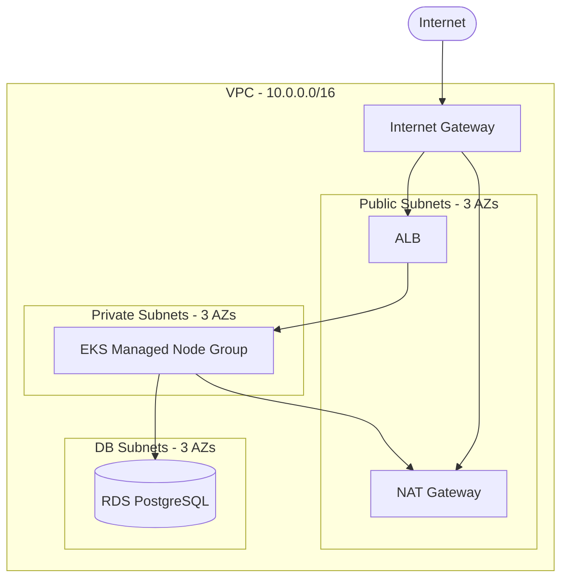
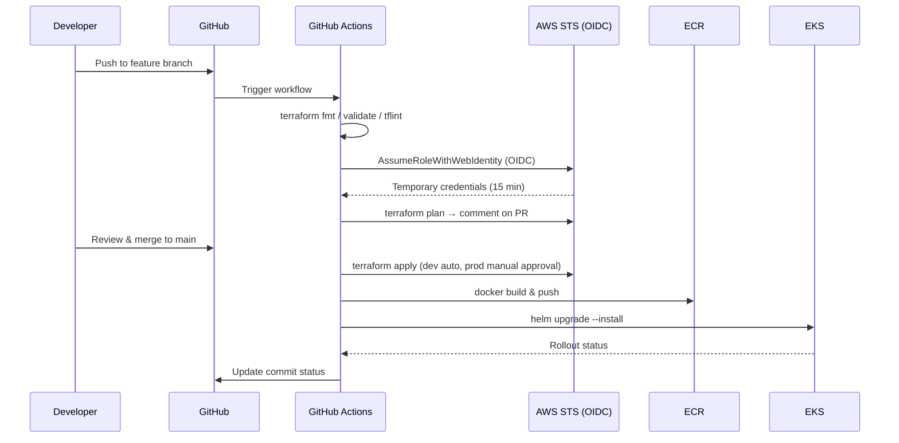
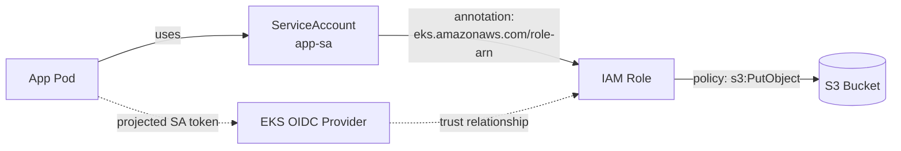

# Architecture

This document expands on the top-level diagram in the [README](../README.md) with component-specific views and design rationale.

## Network Topology

**Rationale:**
- Three Availability Zones for high availability without overpaying for cross-AZ traffic in a demo.
- Worker nodes live in private subnets; only the ALB is internet-facing.
- DB subnets are isolated from worker subnets by separate route tables — defense in depth.
- A single NAT Gateway is used by default (cost optimization); production environments can switch to one-per-AZ via a variable.

## CI/CD Flow

**Why OIDC:** No long-lived AWS access keys live in GitHub secrets. The workflow trades a short-lived OIDC token for temporary STS credentials scoped to a specific IAM role with least-privilege policies. This is the AWS-recommended pattern for CI/CD and removes an entire class of credential-leak risk.

## IRSA (IAM Roles for Service Accounts)

**Rationale:** Pods receive scoped AWS credentials without sharing the node IAM role or mounting long-lived keys. The app pod can only assume the IAM role needed to write a document to S3 — the database connection still goes through a Kubernetes Secret because RDS uses native PostgreSQL auth.

## Design Decisions

| Decision | Choice | Rationale |
|----------|--------|-----------|
| Multi-env strategy | Separate `environments/dev` + `environments/prod` directories | Clearer blast radius vs Terraform workspaces; easier to diff plans per environment |
| EKS module | `terraform-aws-modules/eks` | Well-maintained, encodes AWS best practices, far less code than rolling our own |
| Node scaling | Managed node groups first, Karpenter as Phase 7 upgrade | Managed groups are simpler to reason about; Karpenter is shown as an evolution, not a starting point |
| Database | RDS PostgreSQL (not in-cluster) | Managed backups, automated minor version upgrades, simpler RPO/RTO story |
| Container registry | ECR (private) | Native IAM auth — no separate credential management |
| Ingress | AWS Load Balancer Controller (ALB) | Native ALB integration; cheaper than NLB-per-service for HTTP workloads |
| State backend | S3 + DynamoDB | Industry standard; DynamoDB lock prevents concurrent applies |
| Secrets | Kubernetes Secrets + External Secrets Operator (Phase 6+) | Start simple, migrate to AWS Secrets Manager when the demo justifies it |
